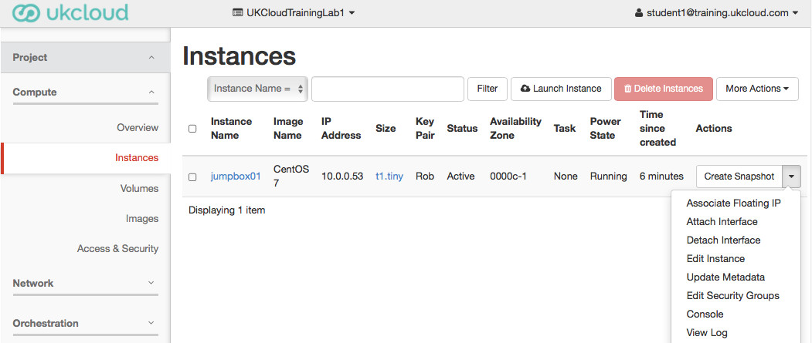
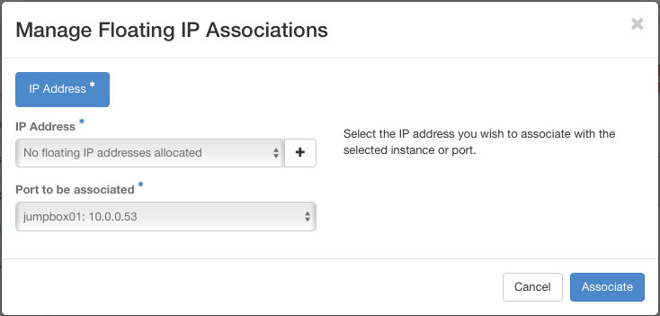
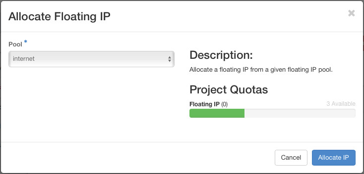
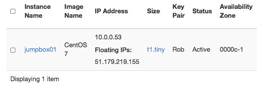

Associating a Floating IP Address
===========================
Now we have an instance running, we can connect outbound to external services with the neutron router performing Source Network-Address-Translation. However to connect into the instance, we need to associate a Floating IP Address to our instance so that the router can DNAT inbound connections.

Navigate to the Instances screen from the menu on the left of the screen. Expand the drop-down menu at the end of the line with your new instance. The top option is ```Associate Floating IP```.



If you have no spare floating IP addresses allocated to your project, you will first have to allocate an address by clicking the ```+``` button to the right of the IP Address drop-down.



The Allocate Floating IP window will already have the ```internet``` external network selected, so will allocate an externally routed IPv4 to your project.



When your external IP address is allocated to the project, you will be taken back to the ```Manage Floating IP Associations``` window, this time with the IP Address field populated with the new address. 

Clicking the ```Associate``` button will configure neutron's router with a DNAT rule to forward all traffic to the external IP address. The associated Floating IP address is then shown in the instance list alongside the relevant internal IP address for the instance.

