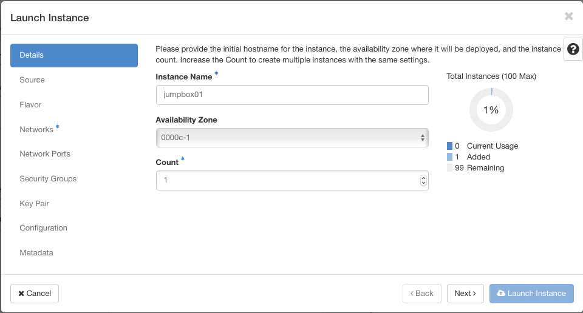
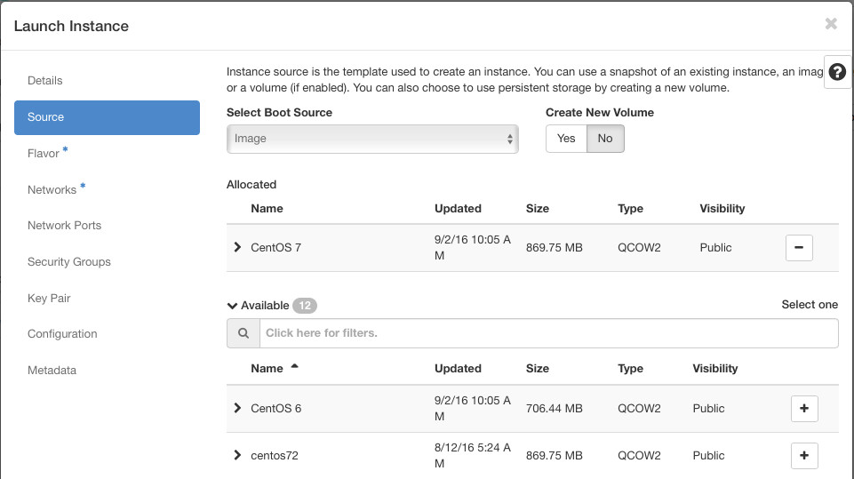
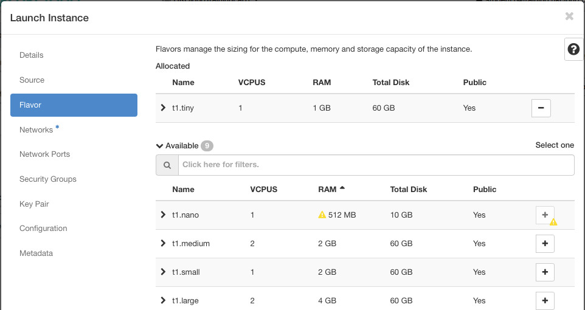
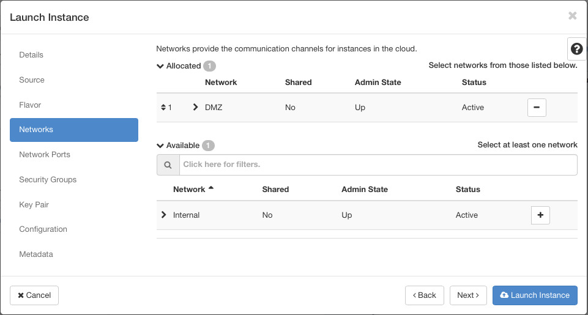
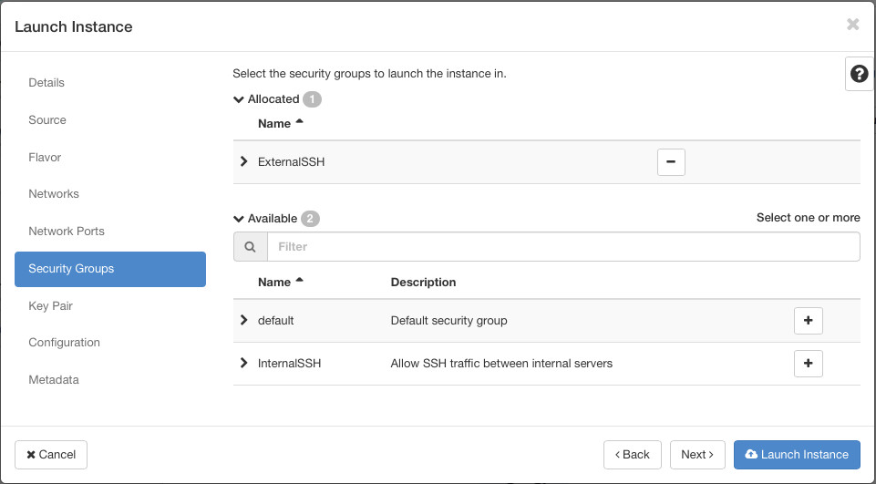
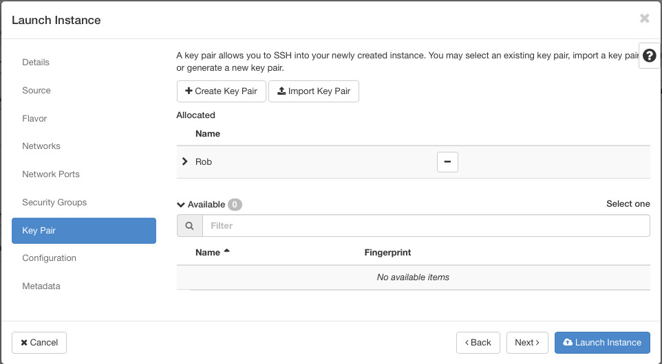

Launching an Instance
==================
All our supporting infrastructure is now in place. We have defined security groups, configured our SSH Key Pair and built our logical networks with a router connecting them all together. There's just a few more decisions you'll need to make in order to launch your first instance.

## Launching from the Topology View
There are a number of places that you can trigger the process of launching an instance. Since we used the Network Topology view to create the Networks and Router, we will continue with the same view to launch our instance.

### Availability Zones
On clicking on the ```Launch Instance``` button, you can give your new instance a name, and then make a choice of which Availability Zone to create the instance in. You have two zones to choose from, both share the same logical networks and underlying cinder storage, but the underlying hosts, power and network infrastructure have been divided into separate failure domains, meaning that if one zone suffers a failure or an outage of some form, the other will be unaffected. This allows you to design resilient applications by spreading functionality across multiple failure domains.



### Select Boot Source
Usually, you will be booting from an Image, either one that UKCloud provides in the public catalog, or one that you have customised within your own project. Other options do exist though, allowing booting a new instance from instance or volume snapshots. 

In this lab, we will select the ```CentOS 7``` image and leave the ```Create New Volume``` option set to ```No```.



### What Resources should the instance have
OpenStack is prescriptive in handling CPU / Memory / Disk allocated to instances. There is a predefined list of ```Flavors``` that you can choose from, giving you varying numbers of vCPU, memory and ephemeral disk.

For this lab, you could choose the ```t1.tiny``` flavor.



### Connecting to the project Infrastructure
The next tab in the launch wizard allows you to choose which of your project networks you want to attach this new instance to. We'll attach this first instance to the DMZ network.



### Security Groups
Skipping over the ```Network Ports``` tab with nothing to change, you can now choose the ```ExternalSSH``` security group that we defined earlier. You can apply multiple security groups to an instance, in which case OpenStack merges all the rules together.



### SSH Key Pair
The last thing you have to select before you can launch your first instance is the SSH Key Pair that we setup earlier.



Now lets click that ```Launch Instance``` button and watch the instance starting to build.