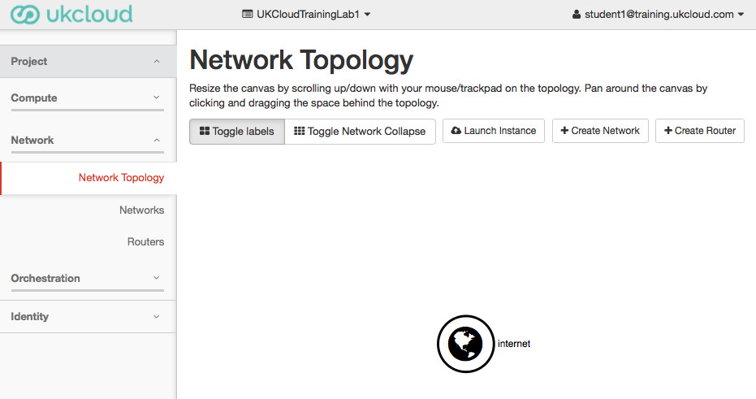
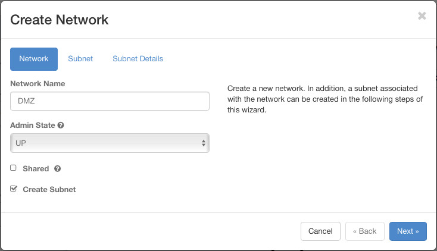
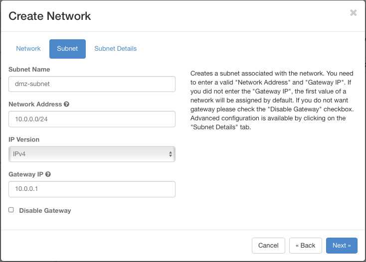
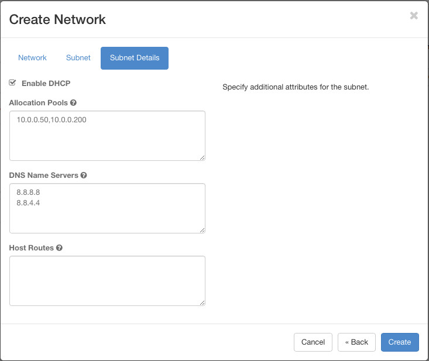
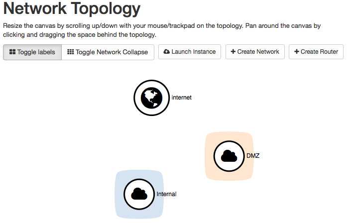
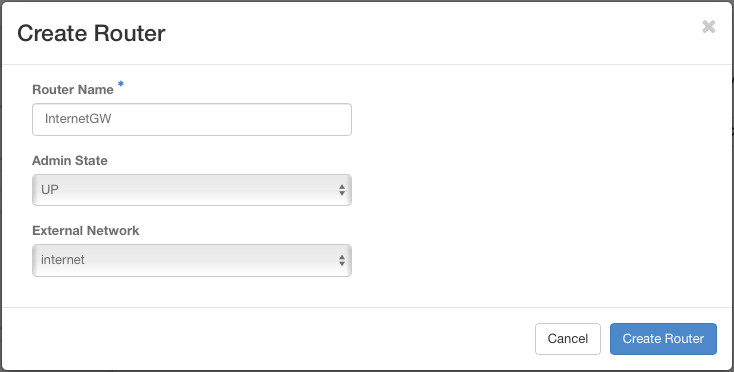
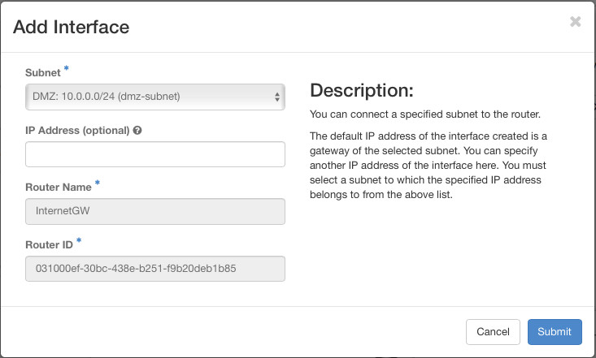
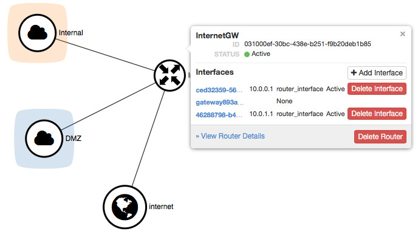

Network Connectivity
=================
In OpenStack, the Neutron SDN service allows you to create multiple Networks within your project, and then define one or more subnets within a Network. Typically though, there is a 1-to-1 relationship between Network and Subnet.

In this section we are going to create a DMZ network for a jumpbox server, and an Internal network for everything else. We will see how to create a router to interconnect the two networks, and also to provide connectivity to our 'external network', the internet.

## Creating our networks
Under the ```Network``` menu on the left of the screen, you can access the individual Networks and Routers menus, however the Network Topology menu gives an easier way of viewing and creating our network links.




### Create the DMZ Network
Clicking the ```Create Network``` button will launch a wizard-style walk through to create your Network and Subnet. Name your new network ```DMZ``` and proceed to the next screen.



Name the subnet and choose a suitable Network Address range, say ```10.0.0.0/24```. The Gateway IP address is the address that will be taken by the router when we hook it up to our network in a few more steps. Although OpenStack will automatically take the first address in our specified range, it's best to be explicit and allocate the address yourself.



The last screen defines the DHCP options used by neutron's DHCP service. There are only a few use-cases where you would want to disable DHCP. You should as a minimum specify some dns servers that will be pushed out with any DHCP allocated IP addresses. UKCloud does not provide local DNS relays, so use Google's public DNS servers unless you will be provisioning your own DNS servers.



### Create the Internal Network
Repeat the last section to create your ```Internal``` network, using the ```10.0.1.0/24``` address range and the same DNS Servers in the DHCP options.

## Connecting our networks
By this stage, our project has defined two networks, and has access to a third 'external' network, as we can see in the Network Topology view.



### Create Your Router
Clicking the ```Create Router``` button will ask you to name the router and select the External Network. You only have one available in this lab, so select ```internet```.



The new router now shows up in the topology view with a link to the ```internet```. If you click on the router, you'll see the status is Active, and an ```Add Interface``` button. We will now add two new interfaces, one for each of our project networks.



Repeat for the second network. You should be left with the router connecting between all three networks.



