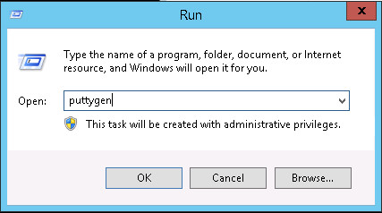
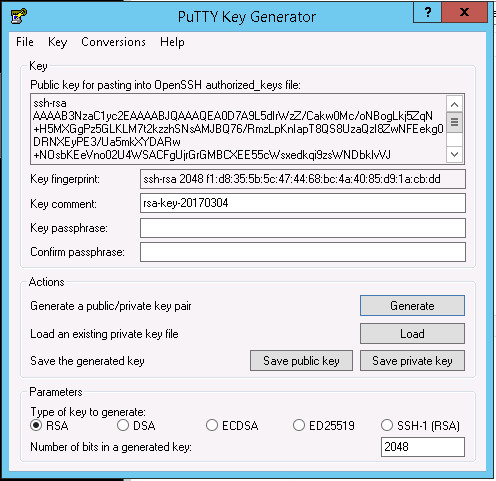
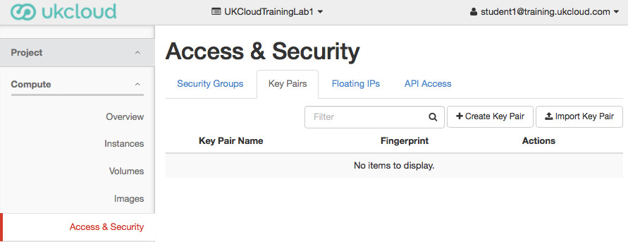
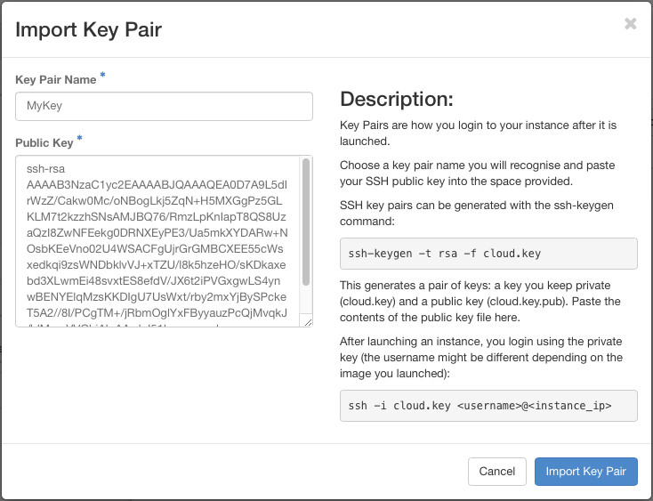

Creating SSH Key pairs
======================

The first thing you will need to do after logging in is to setup an SSH Key Pair that will be used when launching instances. If you not already have an pair of private / public SSH key files to hand, you will need to create one.

### On linux workstations
It is a case of simply running:

``` bash
ubuntu@ubuntu01:~$ ssh-keygen
Generating public/private rsa key pair.
Enter file in which to save the key (/home/ubuntu/.ssh/id_rsa):
Enter passphrase (empty for no passphrase):
Enter same passphrase again:
Your identification has been saved in /home/ubuntu/.ssh/id_rsa.
Your public key has been saved in /home/ubuntu/.ssh/id_rsa.pub.
The key fingerprint is:
SHA256:WNKDensbGs41+4I3xx6VSgILJqeDmSbrhbqsSFB+k2M ubuntu@ubuntu01
The key's randomart image is:
+---[RSA 2048]----+
|                 |
|       o         |
|  o + + +        |
| * = + * .   .   |
|*.+ E + S . o    |
|+..+ + . o o     |
|.o .  o.=.o      |
|* .  o.=+=o.     |
|*+    +.o*o      |
+----[SHA256]-----+
ubuntu@ubuntu01:~$
```

The /home/ubuntu/.ssh/id_rsa.pub public key file is the one we'll upload to OpenStack.

### On windows workstations

You don't have OpenSSH tools installed, so the most common SSH client used on windows workstations is PuTTY. To create an SSH Key pair, run the puttygen program.

Click the ```Generate``` button and follow the instructions for randomising the key. Eventually, your screen will change to show the public key as a string you can copy / paste into OpenStack.

Remember to set a passphrase to protect your private key, and update the ```Key comment``` field to something more meaningful. Click the ```Save private key``` button to save the private key in a PuTTY specific format that we will use later.

## Uploading Your Public Key
Having logged into the [Horizon UI](https://cor00005.cni.ukclcoud.com), select the ```Access & Security``` menu on the left side of the screen and click the ```Key Pairs``` tab.

Having already created our SSH private and public key files, click the ```Import Key Pair``` button and paste your public key file contents into the box.

The Key Pair Name that you use is what you will select when launching an instance, so make sure that it is meaningful and unique.