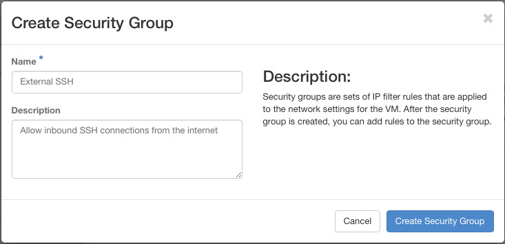
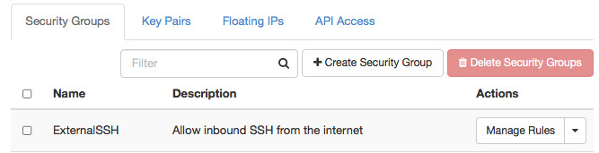
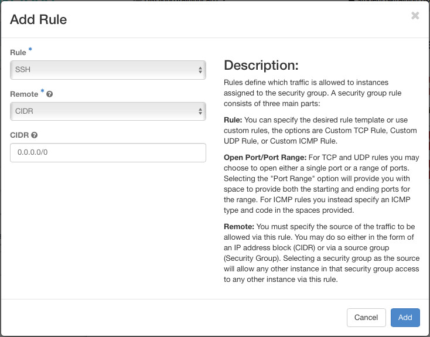
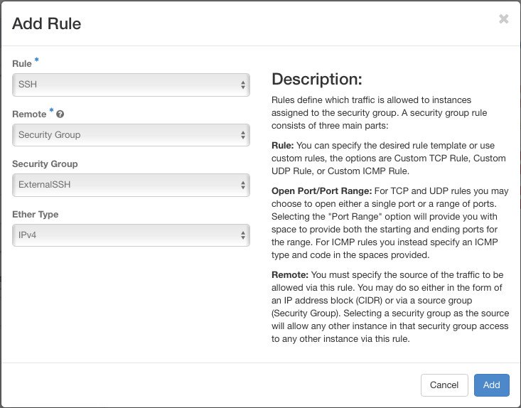

Defining Security Groups
====================
In OpenStack, the Security Group can be considered a per-instance firewall. It is implemented at the hypervisor level, between the virtual switch in the neutron SDN and the ethernet port presented to your instance. It is completely independent of the Guest OS running on the instance and as such, many cloud users completely disable any OS implemented firewalls and solely rely on the security group definitions applied to the instance.

The Security Groups defined in your project can be managed from the ```Access & Security``` menu on the left of the screen, under the ```Security Groups``` tab.

## Allowing inbound SSH from Anywhere
A common infrastructure design pattern is to have a 'Jumpbox' or 'bastion' server in a DMZ network which is accessible to the outside world. Support staff can then connect to this server, and from there manage the internal infrastructure by using the jumpbox as a relay.

### Create a security group to allow inbound SSH access
Click the ```Create Security Group``` button.



Give the new rule a name and description. Once created, you can click the ```Manage Rules``` button.



When you click ```Add Rule``` you can select from a drop-down list of common ports, or select ```Custom TCP Rule``` and specify your own port or range of TCP ports. Similar options exist for UDP and ICMP. In this case, select ```SSH``` from the drop down.



You could be selective about where you allow the SSH connections to originate from by specifying the CIDR network address for say your office network, but for this lab just leave the default.

### Connectivity Debugging

Add a second rule to the security group that allows all ICMP traffic from anywhere. This is useful for debugging connectivity issues as it will allow the use of tools like ping and traceroute.

## Allowing SSH from the Jumpbox to Internal Servers
At this point, we have not created our jumpbox server, or even defined the DMZ network it will sit on, so how do we define the source address of the relayed connection going from the jumpbox to internal servers ? Instead of specifying the source as a CIDR network address, OpenStack's Security Groups also allow the source address (or Remote address as it is referred to in the Horizon UI) to be defined as another security group.

### Create a new security group to allow internal SSH access
Create a new group as we did before. This time, when adding the rule to allow SSH connections, change the ```Remote``` drop down option to ```Security Group```.



This time the option change to give you a drop down list of your current Security Groups. Even though we haven't created our jumpbox server yet, we know that it will have our previously created ```ExternalSSH``` security group applied, so by defining this internal ssh rule in terms of the external ssh group, it doesn't matter what IP address the jumpbox server is eventually allocated, it will always be allowed to SSH to internal servers.

### Allow SSH connections between any internal server

Add a second rule to this new security group. This time, when changing the ```Remote``` drop down to Security Group, choose this second group in the list of security groups - it will be labelled ```(current)```.