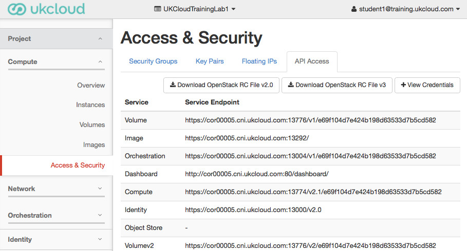
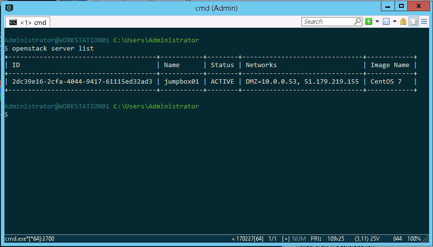
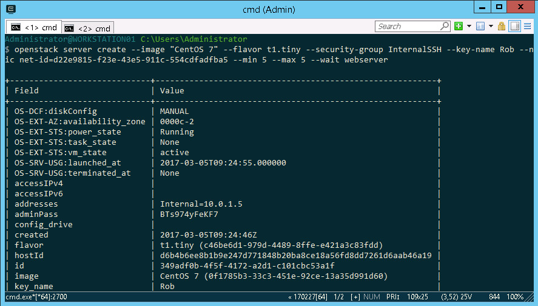

Using the OpenStack Command Line tools
======================================

# Installing the CLI
The lab workstations already have the OpenStack CLI installed, but if you want to install the CLI on your own laptop, the process is documented  [here on OpenStack's website](https://docs.openstack.org/user-guide/common/cli-install-openstack-command-line-clients.html). In short, the CLI is implemented in Python, so you will need a python interpreter installed. 

 1. Install Python. Python 3.x is supported, though some of the HEAT client functionality seems buggy, so personally I would install the latest Python2.x (at least on windows).
 2.  Install the Python Setuptools package.
 3. Use easy_install from the Setuptools package to install the Python pip package.
 4. Use pip to install the CLI tools: ```pip install python-openstackclient```

# Setting up User Credentials
The OpenStack CLI, as well as all libraries and automation tools that interact with the OpenStack API, make use of environment variables to configure connectivity and credentials. The variables are all named ```OS_*```

The lab workstations already have the OpenStack environment variables configured, but if you want to configure the CLI on your own laptop, you can retrieve the environment variables and their settings from the Horizon UI. Browse to the ```Access & Security``` menu on the left side of the screen and click the ```API Access``` tab.



Clicking the ```Download OpenStack RC File v2.0``` button will retrieve a shell script that you can use directly on linux/mac workstations to configure the necessary environment variables.

Windows users will need to take the values in the script and convert them to equivalent Powershell, for example:
``` 
set OS_AUTH_URL=https://cor00005.cni.ukcloud.com:13000/v2.0
set OS_TENANT_NAME=UKCloudTrainingLab1
...
```
or to set them as persistent variables between sessions:
``` powershell
[Environment]::SetEnvironmentVariable("OS_AUTH_URL", "https://cor00005.cni.ukcloud.com:13000/v2.0", "User")
[Environment]::SetEnvironmentVariable("OS_TENANT_NAME", "UKCloudTrainingLab1", "User")
...
```

# Manipulating Instances
With the CLI installed and your credentials configured, the first command you will probably want to run is:



The next command you try is likely to be:
``` bash
ubuntu@ubuntu01:~$ openstack help
usage: openstack [--version] [-v | -q] [--log-file LOG_FILE] [-h] [--debug]
                 [--os-cloud <cloud-config-name>]
                 [--os-region-name <auth-region-name>]
                 [--os-cacert <ca-bundle-file>] [--os-cert <certificate-file>]
                 [--os-key <key-file>] [--verify | --insecure]
                 [--os-default-domain <auth-domain>]
                 [--os-interface <interface>] [--timing] [--os-beta-command]
                 [--os-compute-api-version <compute-api-version>]
                 [--os-network-api-version <network-api-version>]
                 [--os-image-api-version <image-api-version>]
...
```
The help subcommand will list all the options and subcommands you can use with the CLI. for example, part-way down that long output is a list of all the server related commands:
``` bash
  server add floating ip  Add floating IP address to server
  server add security group  Add security group to server
  server add volume  Add volume to server
  server backup create  Create a server backup image
  server create  Create a new server
  server delete  Delete server(s)
  server dump create  Create a dump file in server(s)
  server group create  Create a new server group.
  server group delete  Delete existing server group(s).
  server group list  List all server groups.
  server group show  Display server group details.
  server image create  Create a new server disk image from an existing server
  server list    List servers
  server lock    Lock server(s). A non-admin user will not be able to execute actions
  server migrate  Migrate server to different host
  server pause   Pause server(s)
  server reboot  Perform a hard or soft server reboot
  server rebuild  Rebuild server
  server remove fixed ip  Remove fixed IP address from server
  server remove floating ip  Remove floating IP address from server
  server remove security group  Remove security group from server
  server remove volume  Remove volume from server
  server rescue  Put server in rescue mode
  server resize  Scale server to a new flavor
  server restore  Restore server(s)
  server resume  Resume server(s)
  server set     Set server properties
  server shelve  Shelve server(s)
  server show    Show server details
  server ssh     SSH to server
  server start   Start server(s).
  server stop    Stop server(s).
  server suspend  Suspend server(s)
```

To get more help on a subcommand, use the ```--help``` command line option.

``` bash
ubuntu@ubuntu01:~$ openstack server create --help
usage: openstack server create [-h] [-f {json,shell,table,value,yaml}]
                               [-c COLUMN] [--max-width <integer>]
                               [--print-empty] [--noindent] [--prefix PREFIX]
                               (--image <image> | --volume <volume>) --flavor
                               <flavor>
                               [--security-group <security-group-name>]
                               [--key-name <key-name>]
                               [--property <key=value>]
                               [--file <dest-filename=source-filename>]
                               [--user-data <user-data>]
                               [--availability-zone <zone-name>]
                               [--block-device-mapping <dev-name=mapping>]
                               [--nic <net-id=net-uuid,v4-fixed-ip=ip-addr,v6-fixed-ip=ip-addr,port-id=port-uuid>]
                               [--hint <key=value>]
                               [--config-drive <config-drive-volume>|True]
                               [--min <count>] [--max <count>] [--wait]
                               <server-name>
```

Creating a new instance from the CLI requires the same choices of image, flavor, network, SSH Key Pair etc that we had to make in the Horizon UI. To obtain the values you need to use, you can use some of these commands:
``` bash
openstack image list
openstack flavor list
openstack keypair list
openstack network list
```

Putting it all together, to launch multiple new instances from the CLI, you could use:



Now if you list the servers, you will see that OpenStack has automatically appended a number to the server name you specified on the CLI.

``` bash
ubuntu@ubuntu01:~$ openstack server list
+--------------------------------------+-------------+--------+-------------------------------+------------+
| ID                                   | Name        | Status | Networks                      | Image Name |
+--------------------------------------+-------------+--------+-------------------------------+------------+
| dcefdcc4-67a2-45e0-b38e-c0ec45413f84 | webserver-5 | ACTIVE | Internal=10.0.1.9             | CentOS 7   |
| 123154b7-6d33-4e9f-9b93-977bc47fc1df | webserver-4 | ACTIVE | Internal=10.0.1.8             | CentOS 7   |
| 83a9a757-2a3c-4cf9-95dd-9aec878e3629 | webserver-3 | ACTIVE | Internal=10.0.1.6             | CentOS 7   |
| 8c634ead-9b6e-4e70-ad8a-34547d7d2d07 | webserver-2 | ACTIVE | Internal=10.0.1.7             | CentOS 7   |
| 349adf0b-4f5f-4172-a2d1-c101cbc53a1f | webserver-1 | ACTIVE | Internal=10.0.1.5             | CentOS 7   |
| 2dc39e16-2cfa-4044-9417-61115ed32ad3 | jumpbox01   | ACTIVE | DMZ=10.0.0.53, 51.179.219.155 | CentOS 7   |
+--------------------------------------+-------------+--------+-------------------------------+------------+
```

You can stop instances with the ```openstack server stop``` command:

``` bash
ubuntu@ubuntu01:~$ openstack server stop webserver-5 webserver-4 webserver-3
ubuntu@ubuntu01:~$ openstack server list
+--------------------------------------+-------------+---------+-------------------------------+------------+
| ID                                   | Name        | Status  | Networks                      | Image Name |
+--------------------------------------+-------------+---------+-------------------------------+------------+
| dcefdcc4-67a2-45e0-b38e-c0ec45413f84 | webserver-5 | SHUTOFF | Internal=10.0.1.9             | CentOS 7   |
| 123154b7-6d33-4e9f-9b93-977bc47fc1df | webserver-4 | SHUTOFF | Internal=10.0.1.8             | CentOS 7   |
| 83a9a757-2a3c-4cf9-95dd-9aec878e3629 | webserver-3 | SHUTOFF | Internal=10.0.1.6             | CentOS 7   |
| 8c634ead-9b6e-4e70-ad8a-34547d7d2d07 | webserver-2 | ACTIVE  | Internal=10.0.1.7             | CentOS 7   |
| 349adf0b-4f5f-4172-a2d1-c101cbc53a1f | webserver-1 | ACTIVE  | Internal=10.0.1.5             | CentOS 7   |
| 2dc39e16-2cfa-4044-9417-61115ed32ad3 | jumpbox01   | ACTIVE  | DMZ=10.0.0.53, 51.179.219.155 | CentOS 7   |
+--------------------------------------+-------------+---------+-------------------------------+------------+
```

and restart them again with ```openstack server start```

``` bash
ubuntu@ubuntu01:~$ openstack server start webserver-3 webserver-4
ubuntu@ubuntu01:~$ openstack server list
+--------------------------------------+-------------+---------+-------------------------------+------------+
| ID                                   | Name        | Status  | Networks                      | Image Name |
+--------------------------------------+-------------+---------+-------------------------------+------------+
| dcefdcc4-67a2-45e0-b38e-c0ec45413f84 | webserver-5 | SHUTOFF | Internal=10.0.1.9             | CentOS 7   |
| 123154b7-6d33-4e9f-9b93-977bc47fc1df | webserver-4 | ACTIVE  | Internal=10.0.1.8             | CentOS 7   |
| 83a9a757-2a3c-4cf9-95dd-9aec878e3629 | webserver-3 | ACTIVE  | Internal=10.0.1.6             | CentOS 7   |
| 8c634ead-9b6e-4e70-ad8a-34547d7d2d07 | webserver-2 | ACTIVE  | Internal=10.0.1.7             | CentOS 7   |
| 349adf0b-4f5f-4172-a2d1-c101cbc53a1f | webserver-1 | ACTIVE  | Internal=10.0.1.5             | CentOS 7   |
| 2dc39e16-2cfa-4044-9417-61115ed32ad3 | jumpbox01   | ACTIVE  | DMZ=10.0.0.53, 51.179.219.155 | CentOS 7   |
+--------------------------------------+-------------+---------+-------------------------------+------------+
```

Instances can be rebooted with the ```openstack server reboot``` command, taking parameters to specify either a soft or hard reset (equivalent of either pressing ```CTRL-ALT-Del``` or the reset button on a physical server).